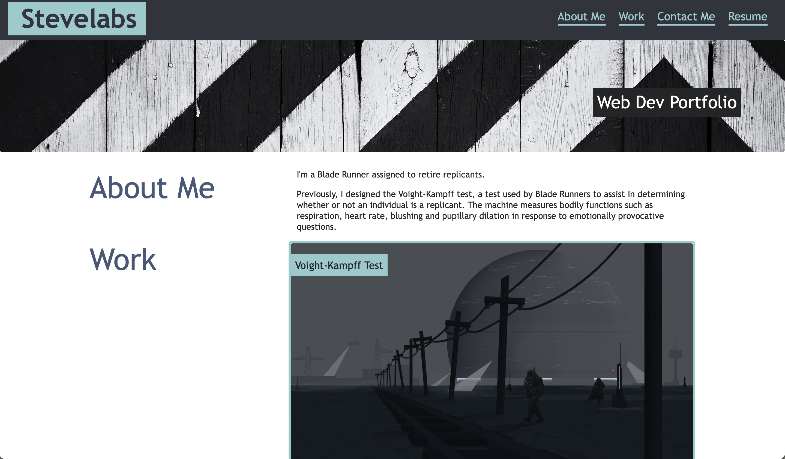
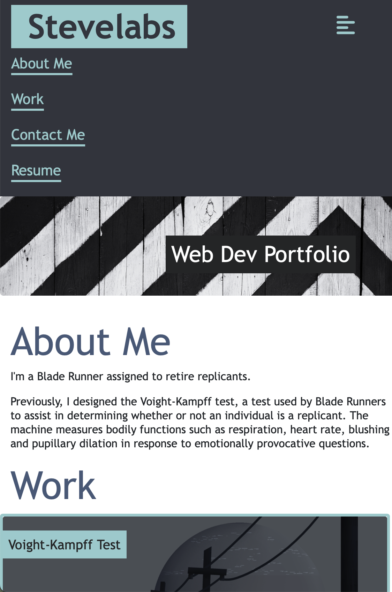
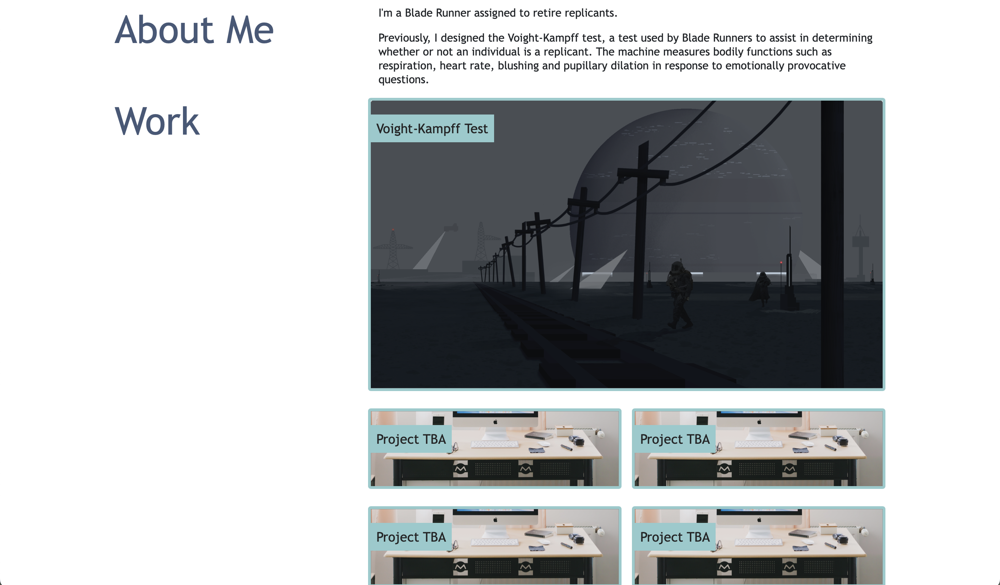

# A Bootstrap 4 Portfolio Template

## Overview

This project is based on an assignment to build a portfolio layout using the Bootstrap 4 CSS Framework. This would be for a portfolio to market your skills as a frontend developer prior to learning javascript and JS frameworks such as React.

I also adapted Bootstrap 4 HTML/CSS to tailor the template.

## Deployment

Application deployed at:
https://stevelab1.github.io/Bootstrap-Portfolio/

GitHub URL:
https://github.com/stevelab1/Bootstrap-Portfolio

## Items

The website includes the following bootstrap components:

- A Navigation bar (modified)

- A navigation menu at the top

  - Links navigate to the appropriate sections of the page

- A hero section

  - A jumbotron that features tagline but could also feature your image, name, and any other information you'd like to include such as news or features

- A work section

  - A section displaying your work

    - A main section for the project yoiu're most proud of or is most recent or relevant to your current goals

  - Bootstrap cards for each project.

    - The description should give a brief overview of the work. Add subtitles once you haver work to display that detail the technologies used

  - Each project should eventually link to a project you are proud of!

- Still to add: a skills section

  - I will add github readme most used languages widget, or just those I know if not accurate
  - Under frameworks/libraries I will add React etc

- An about / contact section.

- Footer section.

  - All hyperlinks should have a hover effect.

  - All buttons should display a box shadow upon hover.

## Screenshot

 

 

 

 

## License

## Credits

edX
Trilogy
Bootstrap 4

---
